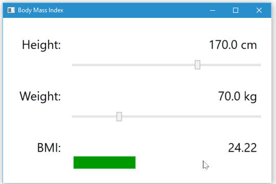
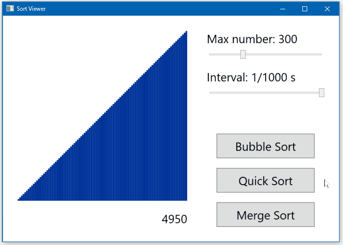

# Tutorials 2016

A set of tutorials for client application development.  
クライアント アプリケーション開発のチュートリアルです。

Microsoft Kinect または Leap Motion Controller を利用した WPF アプリケーションを対象としています。  
主に MVVM パターンを適用し、[ReactiveProperty](https://github.com/runceel/ReactiveProperty) を利用しています。

## XAML
まずは前提知識として、基本的な MVVM パターンのチュートリアルを用意しています。

### BMI
BMI (Body Mass Index) を計算するためのツールです。  
データ バインディングおよび MVVM パターンを学習するためのチュートリアルです。
- [実装手順](https://github.com/sakapon/Tutorials-2016/wiki/XAML-BMI)
- [ソースコード](XAML/Bmi)

### Sort Viewer
ソート アルゴリズムを可視化します。  
MVVM パターンに加えて非同期処理を利用します。上級者向けです。
- [実装手順](https://github.com/sakapon/Tutorials-2016/wiki/XAML-Sort-Viewer)
- [ソースコード](XAML/Sort/SortViewerWpf)

## Leap Motion
### Fingers Tracker
指先の位置を追跡して表示します。
- [実装手順](https://github.com/sakapon/Tutorials-2016/wiki/Leap-Fingers-Tracker)
- [ソースコード](Leap-v2/LeapTutorials/FingersTrackerLeap)

### Air Canvas
領域 z < 0 における指先の軌跡を描画します。
- [実装手順](https://github.com/sakapon/Tutorials-2016/wiki/Leap-Air-Canvas)
- [ソースコード](Leap-v2/LeapTutorials/AirCanvasLeap)

### Image Pinch
2 本の指でつまんで、画像を移動またはズームします。
- [実装手順](https://github.com/sakapon/Tutorials-2016/wiki/Leap-Image-Pinch)
- [ソースコード](Leap-v2/LeapTutorials/ImagePinchLeap)

## バージョン情報
- Visual Studio 2015
- Blend for Visual Studio 2015
- C# 6.0
- .NET Framework 4.5
- ReactiveProperty 2.7.1
- Kinect for Windows SDK 1.8
- Kinect for Windows SDK 2.0
- Leap Motion SDK 2.3.1
